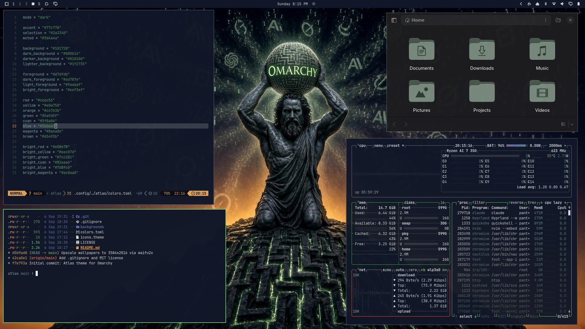
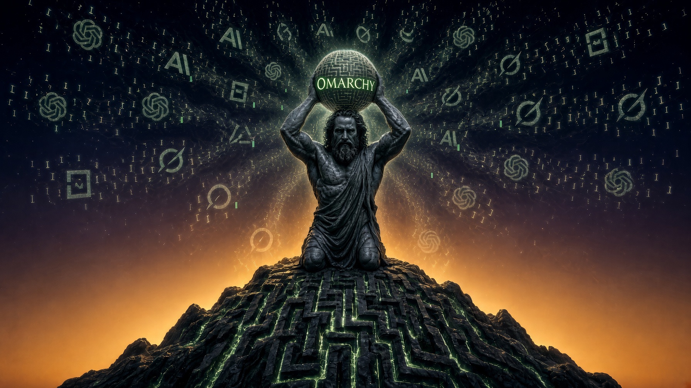
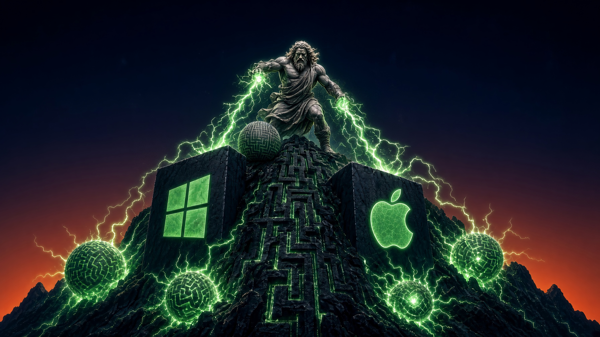
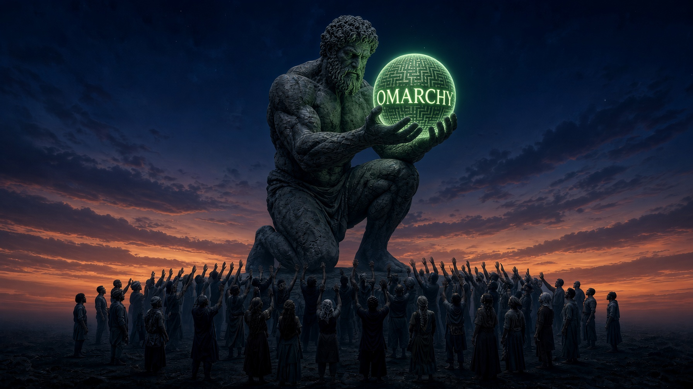

# Atlas

A dark, cinematic Omarchy theme. Your computer should belong to you — built in the open, not handed down from a platform. And nobody carries that weight alone, least of all now that our coding agents have shown up to help hold the sky (they never sleep, they never complain, and they only occasionally hallucinate a load-bearing wall).

## Preview



## Install

```bash
omarchy theme install https://github.com/pantherdev2024/omarchy-atlas-theme
```

Then select it:

```bash
omarchy theme set atlas
```

## What's Included

- A deep indigo-navy, amber-horizon, and sage-green palette sampled directly from the wallpaper art rather than picked in the abstract — the desktop and the artwork share the same color grade by construction.
- A single saturated accent (`#77c778`) carried across window borders, cursor, and shell chrome, with everything else held to muted neutrals so focus reads instantly.
- Terminal signal colors (`red`, `yellow`, `green`) deliberately boosted past 4.5:1 contrast, so git diffs, test failures, and warnings stay legible instead of dissolving into the mood.
- Full Omarchy shell treatment — bar, menus, notifications, and lock screen — plus terminal, editor, and app theming generated from `colors.toml`.
- Three coordinated 3584×2016 wallpapers.

## Wallpapers

<table>
  <tr>
    <td align="center">
      <br>
      <sub><b>Atlas</b> — bearing the orb atop the labyrinth mountain</sub>
    </td>
    <td align="center">
      <br>
      <sub><b>Monoliths</b> — lightning against the old guard</sub>
    </td>
  </tr>
  <tr>
    <td align="center" colspan="2">
      <br>
      <sub><b>Crowd</b> — the orb at dusk</sub>
    </td>
  </tr>
</table>

Cycle between them with `omarchy theme bg next`.

## Notes

- `colors.toml` is the single source of truth — Omarchy regenerates the terminal, editor, and app configs from it at install time, which is why none of those files ship in this repo.
- Wallpapers are AI-upscaled to 3584×2016, comfortably above 4K width.

## Attribution

- Theme design and palette by [pantherdev2024](https://github.com/pantherdev2024).
- Wallpaper artwork was generated for this theme with Grok Imagine and curated for the palette.
- Some artwork includes stylized, abstract nods to third-party marks for thematic purposes only. All trademarks and imagery remain the property of their respective rights holders. This theme is not affiliated with, endorsed by, or sponsored by any company depicted or alluded to within it.
- The MIT license covers this theme's configuration and documentation; the wallpaper artwork is provided for use with the theme.
